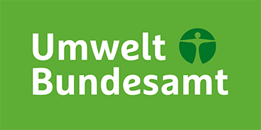

The **Semantic Network Service (SNS)** makes the environmental thesaurus
UMTHES and the Environmental Chronicle publicly available as Linked Open Data.
The application belongs to the **German Environment Agency (Umweltbundesamt,
UBA)**, which runs the service at [sns.uba.de](https://sns.uba.de) and curates
its content; development was carried out by INNOQ on behalf of the UBA.

Beyond interactive search and navigation in the browser, SNS offers reusable
services and APIs for environmental informatics, among them automatic keyword
assignment for documents (**AutoClassify**) and the retrieval of semantically
similar concepts (**SimilarTerms**).

The architecture builds on the open source framework **iQvoc**, a Ruby on
Rails engine architecture, on the standardized W3C formats RDF, SKOS and
SKOS-XL, and on a containerized infrastructure with PostgreSQL and Caddy.
