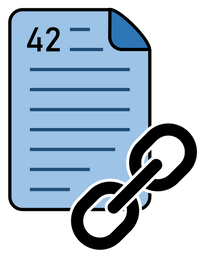

**docToolchain** is the docs-as-code toolchain created by **Ralf D. Müller**:
it turns AsciiDoc into HTML, PDF, microsites and Confluence pages, and pulls
architecture material out of tools like Enterprise Architect so the
documentation can live in the repository next to the code. It has grown with
its community since 2017; this documentation describes **version 4**, a
ground-up rewrite that removes Gradle and jBake in favour of plain Groovy
scripts and adds an LLM-native, MCP-integrated architecture.

Two things make this example worth reading. First, it documents an
**architecture in transition**: the building block view reasons openly about
the v3→v4 delta — what was removed and why — and one ADR even records that
its accepted decision was reversed during implementation. Second, it is
unusually well cross-wired: quality scenarios, risks, threats and decisions
all carry stable IDs and reference each other, so every decision names the
scenarios it supports and the risks it creates — the goals→strategy→decisions
traceability chain arc42 recommends, worked end to end.

The chapters were written for a tool that builds documentation, by the people
who build it — down to a runtime scenario for error recovery and a quality
tree with nineteen six-part scenarios.
