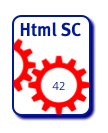

The system documented here is a small open source tool hosted on
[GitHub](https://github.com/aim42/htmlSanityCheck).

The full sourcecode is available — you might even configure your Gradle build
to use this software. Just in case you're writing documentation based on
Asciidoctor, that would be a great idea!

But enough preamble. Let's get started…

> **Convention for this example**
>
> At the beginning of each section you find short explanations, formatted in
> boxes like this.

This is the smallest example on the site, and the most readable end to end.
It is worth comparing against [MaMa-CRM](../mama/): the same twelve sections,
one describing a single-maintainer build tool, the other a system built by ten
people over fifteen months.
