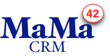

MaMa-CRM takes the burden of (usually paper-based) customer contacts from
organizations working in mass markets, like insurance, credit-card providers,
mobile telecommunication providers, energy and water providers or large
real-estate companies (in MaMa speak these are called «Mandator»).

It has been initially ordered by an independent mid-sized data center to
support the launch of the German (government-enforced) e-Health-Card — and
later on used to support _campaigns_ like telephone billing, electrical-power
metering and similar stuff.

For every mandator, there is at least one completely independent MaMa-CRM
instance running, which is specifically configured for its mandator and a
campaign.

MaMa-CRM architecture documentation is quite heavy in the requirements part,
describing several _aspects of flexibility_ that triggered many central
architecture decisions.

The team that built the system consisted of 7-10 persons working in 2-4 week
iterations for about 15 months.

Me (Gernot Starke) had the honor to be part of that team in a responsible
role. The original client allowed me to talk and write about the system
without disclosing the company name. I was not allowed to use any of the
original documentation or source code.

Thanx to Thorsten, Sven, Arno and a few unnamed other guys for great
cooperation and a successful finish.

> In the [full book](https://leanpub.com/arc42byexample), MaMa-CRM is
> completely documented. Especially the architecture decisions and solution
> concepts that support the enormous flexibility may be worth a read :-)
