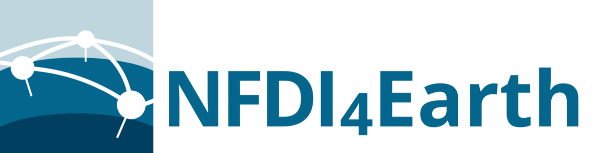

**NFDI4Earth** is the Earth System Sciences consortium of Germany's
*Nationale Forschungsdateninfrastruktur* (NFDI) — 67 partner institutions,
coordinated by TU Dresden and funded by the German Research Foundation (DFG,
project no. 460036893). Earth system data exists in abundance: hundreds of
repositories, catalogues, portals and tools, each built by a different
institute for a different discipline. NFDI4Earth links them into one place to
search, and leaves every one of them where it is.

Two things make it worth reading. It documents a **portfolio, not a system** —
five services the consortium builds itself, plus a long tail it only harvests
from — so section 3 spends most of its length on what NFDI4Earth does *not*
promise about other people's servers. And it is **unfinished in public**: seven
of the twelve sections are written, and the rest say so, in the original as
well as here.

## The architecture team

Software decisions for NFDI4Earth are not made by whoever writes the code.
They are made by a standing **NFDI4Earth Architecture Team**, on the proposal
of and in consultation with the measure lead responsible for the service —
within 14 days, and escalating to the steering group when team and measure
lead cannot agree. Section 9 documents that process before it documents any
decision, which is the right order and a rarer thing to find written down than
the decisions themselves.

The team is **Auriol Degbelo, Christin Henzen, Carsten Keßler, Ralf Klammer,
Daniel Nüst** and **Claus Weiland**, from TU Dresden, Hochschule Bochum and the
Senckenberg Gesellschaft für Naturforschung. It can be reached at
[nfdi4earth-architecture@tu-dresden.de](mailto:nfdi4earth-architecture@tu-dresden.de),
and its work is described on the
[software architecture team page](https://www.nfdi4earth.de/2coordinate/software-architecture-team).

The documentation reproduced here was written by **Christin Henzen, Anna
Brauer, Auriol Degbelo, Stephan Frickenhaus, Jonas Grieb, Stephan Hachinger,
Ralf Klammer, Claudia Müller, Johannes Munke, Tom Niers, Daniel Nüst, Claus
Weiland and Alexander Wellmann**.

## Where to go next

**The consortium**

- [nfdi4earth.de](https://www.nfdi4earth.de/) — the project home page
- [Software architecture team](https://www.nfdi4earth.de/2coordinate/software-architecture-team) — the six people who take the decisions in section 9

**The services this documentation describes**

- [OneStop4All](https://onestop4all.nfdi4earth.de/) — the entry point for people
- [EduTrain](https://edutrain.nfdi4earth.de/) — the learning platform
- [NFDI4Earth Ontology](https://nfdi4earth.de/ontology) — the shared metadata schema

**Sources**

- [Software Architecture Documentation, Zenodo, 2024](https://doi.org/10.5281/zenodo.14534839) — the PDF these chapters come from
- [Online architecture documentation](https://nfdi4earth.pages.rwth-aachen.de/architecture/architecture-docs/) — the consortium's living version, which carries the deployment detail
- [Developer guide](https://nfdi4earth.pages.rwth-aachen.de/architecture/devguide/) — the conventions constraint 14 refers to
