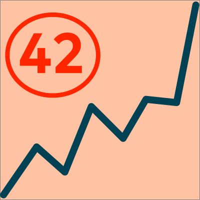

status.arc42.org watches the rest of the arc42 family — arc42.org,
docs.arc42.org, examples.arc42.org and the other sites and subdomains — and
publishes two things about each of them: how many people are visiting, and
whether the site is actually up.

The system is a working instance of the architecture it advocates: a small
Go backend on Fly.io, wrapping four external APIs (Plausible, GitHub,
Fly.io, Slack) behind one domain layer, backed by a Turso database for the
little state it needs to keep. An external cron trigger — not a GitHub
Action, and not an always-on process inside the monitored system itself —
probes every site every 15 minutes, confirms failures before recording
them, and alerts Slack when one goes down.

Where MaMa-CRM and HtmlSanityCheck each document a finished system, this one
documents itself while still being built: twenty architecture decision
records track the reasoning as it happened, several revised in place as the
design changed. [Section 9](09-architecture-decisions/) reproduces all
twenty in full.
